# 🃏 Agentic Poker: The "I Can't Believe It's Not Gambling" Edition 🎲

Welcome to **Agentic Poker**, the only poker app where the players are 100% artificial but the emotional damage is 100% real! 🤖💔

Built with love, sweat, and a lot of caffeine, this project proves that you don't need friends to lose money at poker—you just need Python and some sassy AI agents.

## 🚀 What is this?

It's a **Texas Hold'em** engine where **Autonomous Agents** (powered by code, math, and maybe a little bit of magic) battle it out. You can watch them destroy each other in **Spectator Mode** or jump in and try to bluff a robot in **Play Mode** (good luck with that).

## 🏗️ Under the Hood (The Boring Smart Stuff)

We went full nerd on this one. No spaghetti code here! 🍝❌

### The Architecture (Look at these fancy boxes!)

We use an **Agentic Architecture** with **MCP** (Model Context Protocol). Basically, the Dealer is the boss, and the Players are the minions.

```mermaid
graph TD
    subgraph "The World (Engine)"
        Dealer[🎩 Dealer Agent]
        State[📦 Immutable GameState]
    end

    subgraph "The Minions (Agents)"
        P1[🤖 The Rock]
        P2[🤪 Maniac]
        P3[🤓 The Professor]
    end

    Dealer -- "Here's the situation (MCP Update)" --> P1
    Dealer -- "What do you want to do? (MCP Request)" --> P2
    
    P1 -- "I fold (ActionResponse)" --> Dealer
    P2 -- "ALL IN BABY! (ActionResponse)" --> Dealer
    
    State -.-> Dealer
```



### The "Swim Lanes" of Doom 🏊‍♂️

Here's how a single betting round goes down. It's like a synchronized swimming routine, but with chips.

```mermaid
sequenceDiagram
    participant D as 🎩 Dealer
    participant A as 🤖 Agent
    participant B as 🧠 Brain (Personality)

    Note over D: Round Starts!
    D->>A: 📨 MCP: GAME_STATE_UPDATE (Look at your cards!)
    A->>B: "Yo, we got Pocket Aces!"
    B-->>A: "Act cool..."
    
    D->>A: ❓ MCP: ACTION_REQUEST (Your turn!)
    A->>B: "What do we do?"
    
    alt is Aggressive
        B-->>A: "RAISE TO THE MOON! 🚀"
        A->>D: 👊 ACTION_RESPONSE: RAISE 1000
    else is Tight
        B-->>A: "Run away!"
        A->>D: 🏳️ ACTION_RESPONSE: FOLD
    end
    
    D->>D: 📝 Update State & Pot
    D->>A: 📨 MCP: GAME_STATE_UPDATE (New pot size)
```



## 🛠️ Tech Stack (Buzzword Bingo)

-   **Python 3.13**: Because we like our types strong and our GILs... well, still there (mostly). 💪
-   **Functional Programming**: Immutable state, pure functions. No side effects allowed! (Except emotional ones).
-   **Streamlit + React**: Python in the back, React in the front. It's the mullet of web dev. 💇‍♂️
-   **Tailwind CSS**: Because writing real CSS is so 2010.
-   **BDD Testing**: We have a "Tester Agent" that plays the game to make sure it works. It's inception! 🤯

## 🏃‍♂️ How to Run This Bad Boy

1.  **Install the things**:
    ```bash
    pip install -r requirements.txt
    cd ui/poker_component && npm install
    ```

2.  **Build the shiny UI**:
    ```bash
    cd ui/poker_component
    npm run build
    ```

3.  **Start the party**:
    ```bash
    streamlit run ui/app.py
    ```

4.  **Sit back and watch the chaos.** 🍿

## 🤝 Contributing

Don't. Just kidding! If you want to add a personality that only plays 7-2 offsuit, be my guest. Open a PR and make me laugh.

## 📜 License

MIT. Do whatever you want, just don't blame me if the AI becomes sentient and takes your lunch money. 💸
